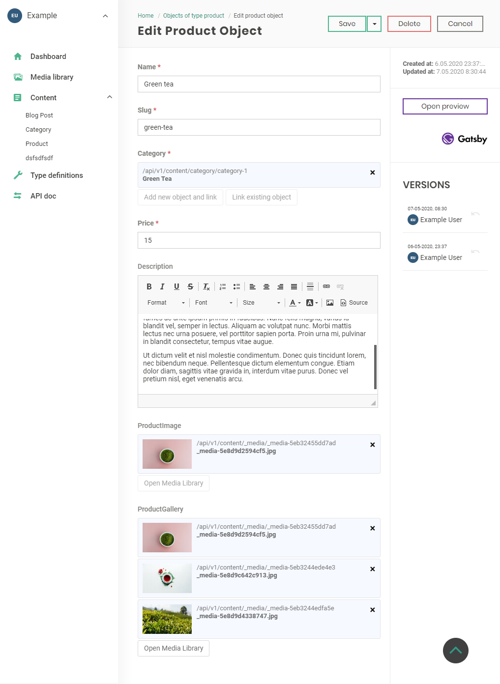

  # Gatsby Starter: Ecommerce and Flotiq

  Ecommerce starter: [Gatsby](https://www.gatsbyjs.org/) + [Flotiq](https://flotiq.com) + [Snipcart](https://snipcart.com).
  
  Live Demo: https://flotiq-starter-products.herokuapp.com

  ## Quick start

  1.  **Setup this site.**

      Use the Gatsby CLI to Clone this site.

      ```sh
      # Clone this Repositories
      gatsby new OneShopper https://github.com/flotiq/gatsby-starter-products.git
      ```

  1.  **Setup "Products" Content Type in Flotiq**

       Create your [Flotiq.com](https://editor.flotiq.com/register.html) account. 
       
       Next, create the `Product` Content Type:
       
       
       
       _Note: You can also create `Product` using [Flotiq REST API](https://flotiq.com/docs/API/):_            
       ```sh
       curl 'https://api.flotiq.com/api/v1/internal/contenttype' -H 'X-AUTH-TOKEN: __YOUR_API_KEY__' -H 'Content-Type: application/json;chars--data-binary ' -X POST --data-binary '{"name":"product","label":"Product","schemaDefinition":{"type":"object","allOf":[{"$ref":"#/components/schemas/AbstractContentTypeSchemaDefinition"},{"type":"object","properties":{"name":{"type":"string","minLength":1},"slug":{"type":"string","minLength":1},"price":{"type":"number","minLength":1},"description":{"type":"string"},"productImage":{"type":"array","items":{"$ref":"#/components/schemas/DataSource"},"minItems":0},"productGallery":{"type":"array","items":{"$ref":"#/components/schemas/DataSource"},"minItems":0}}}],"required":["name","slug","price"],"additionalProperties":false},"metaDefinition":{"propertiesConfig":{"name":{"inputType":"text","unique":true,"isTitlePart":true},"slug":{"inputType":"text","unique":true},"price":{"inputType":"number","unique":false},"description":{"inputType":"richtext","unique":false},"productImage":{"inputType":"datasource","unique":false,"validation":{"relationContenttype":"_media"}},"productGallery":{"inputType":"datasource","unique":false,"validation":{"relationMultiple":true,"relationContenttype":"_media"}}},"order":["name","slug","price","description","productImage","productGallery"]}}' --compressed
       ```
      
  1.  **Configure application**
  
       The last step is to configure our application to know from where it has to fetch the data.
       You can also setup your Snipcart API_KEY to enable store functionality. 
       
       You need to create a file called `.env` inside the root of the directory, with the following structure:

       ```
       GATSBY_FLOTIQ_BASE_URL="https://api.flotiq.com"
       FLOTIQ_API_KEY="YOUR FLOTIQ API KEY"
       SNIPCART_API_KEY="YOUR SNIPCART PUBLIC API KEY"
       ```

  1.  **Start developing.**

      Navigate into your new site’s directory and start it up.

      ```sh
      cd OneShopper
      npm install
      gatsby develop
      ```

  1.  **Open the source code and start editing!**

      Your site is now running at `http://localhost:8000`!

      _Note: You'll also see a second link: _`http://localhost:8000/___graphql`_. This is a tool you can use to experiment with querying your data. Learn more about using this tool in the [Gatsby tutorial](https://www.gatsbyjs.org/tutorial/part-five/#introducing-graphiql)._

      Open a project directory in your code editor of choice and edit `src/pages/index.js`. Save your changes and the browser will update in real time!

  1. **Manage your products using Flotiq editor**
  
     You can easily manage your products using Flotiq editor
  
     
     

  ## 🎓 Learning Gatsby

  Looking for more guidance? Full documentation for Gatsby lives [on the website](https://www.gatsbyjs.org/). Here are some places to start:

  - **For most developers, we recommend starting with our [in-depth tutorial for creating a site with Gatsby](https://www.gatsbyjs.org/tutorial/).** It starts with zero assumptions about your level of ability and walks through every step of the process.

  - **To dive straight into code samples, head [to our documentation](https://www.gatsbyjs.org/docs/).** In particular, check out the _Guides_, _API Reference_, and _Advanced Tutorials_ sections in the sidebar.

  ## 🎓 Learning Flotiq
  
  Using Flotiq you model, author and consume your content, your way. Flotiq is an API-first CMS that takes care of hosting, securing and scaling to guarantee your content is always on.
  
  See what you can do with Flotiq Headless CMS System:
  - [Flotiq.com homepage](https://flotiq.com)
  - [Flotiq docs](https://flotiq.com/docs)
  - [Explore example repositories](https://github.com/flotiq)

  ## Deploy💫💫

  You can deploy this project to Heroku in 3 minutes:

  [](https://heroku.com/deploy?template=https://github.com/flotiq/gatsby-starter-products)
